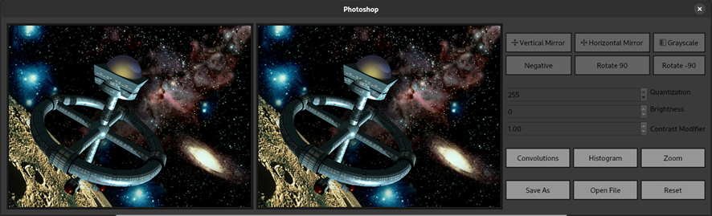
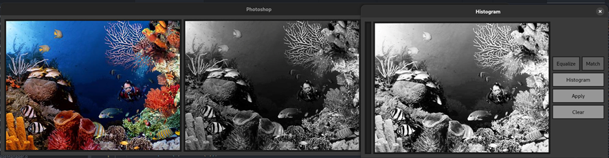
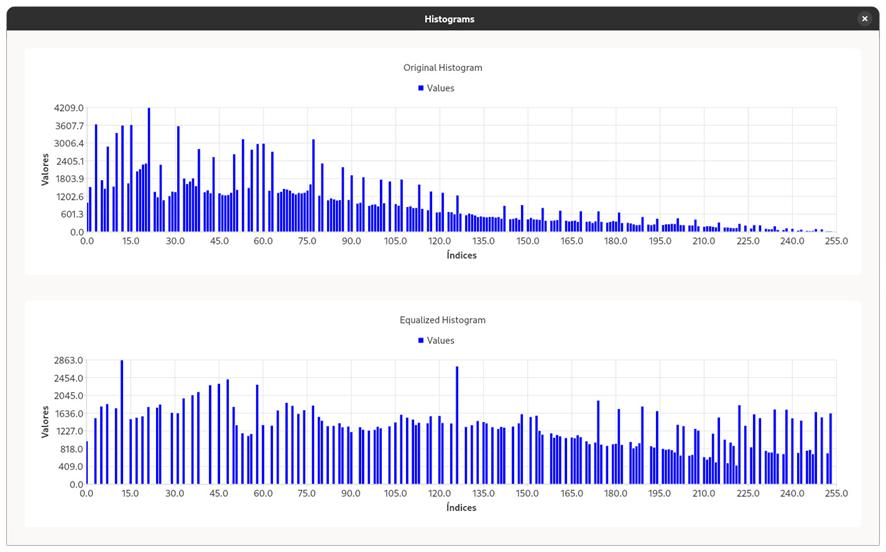
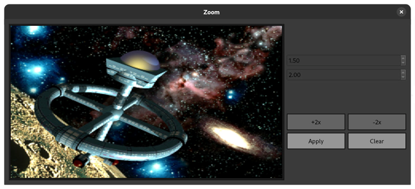
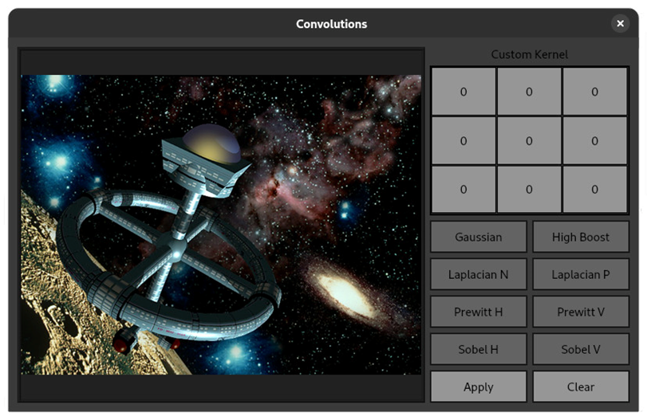

# Image Editor

A project I built for my Fundamentals of Image Processing class. It implements several digital image editing algorithms, and allows the application of various, both pre-defined and user-defined filters, as well as some histogram based operations.  

The image handling is made with OpenCV, and the UI with Qt. Some operations have been parallelized with OpenMP. The UI does not behave well with large images, though.

___

## Pixel-based operations



The main window allows the following functionalities:
* Vertical and Horizontal flipping.
* Grayscale transformation.
* Negative transformation.
* Brightness, contrast and quantization adjustment.

As well as acces to the other menus and the possibility to save, open a new image, and reset the modifications on the image.

___

## Histogram-based operations



The Histogram window allows the following functionalities:
* Histogram Equalization
* Histogram Matching (grayscale only)

On clicking the "Equalize" button, a new window will appear, showing the histogram for the previous and equalized image:


<center>

</center>

___

## Zoom Operations

<center>

</center>
<br>

The Zoom window allows the following functionalities:
* Zooming in
* Zooming out (2x)

___

## Non-linear transformations

<center>

</center>
<br>


This is by far the coolest window. It allows the application of image filters using 2d convolutions. There are many pre-defined filters, but it is also possible to input a filter with any arbitrary values. Some results can be seen [here](filtered/).

___

## How to Build

For Linux Fedora 40

Install the dependencies:

```bash
sudo dnf groupinstall "Development Tools"
sudo dnf install cmake ninja-build libxkbcommon-devel
sudo dnf install qt6-qtbase-devel qt6-qtmultimedia-devel
sudo dnf install qt6-qtcharts-devel
sudo dnf install opencv-devel
```

Generate the Makefile and Build:

```bash
qmake && make
```

Run:

```bash
./main
```
